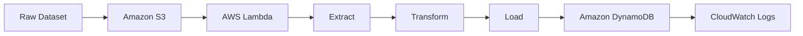
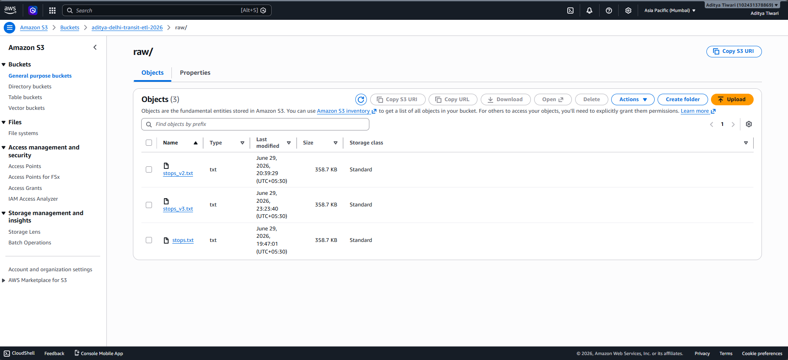
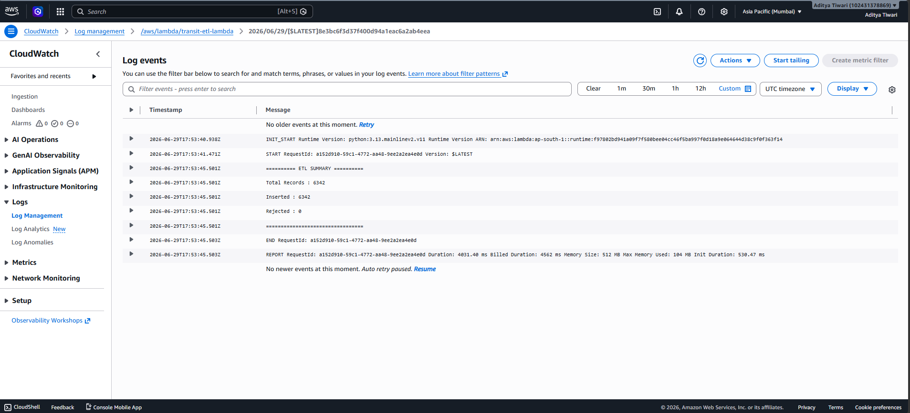
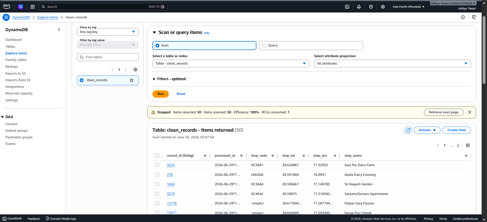
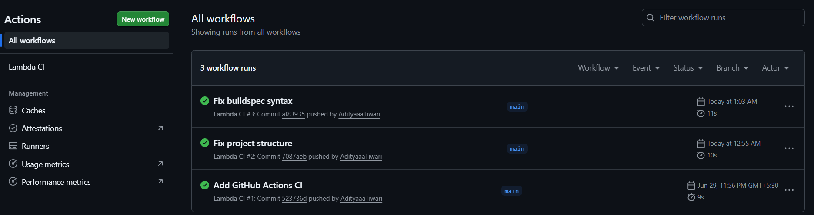
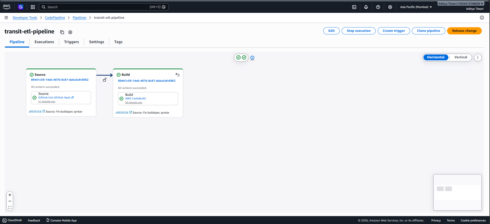
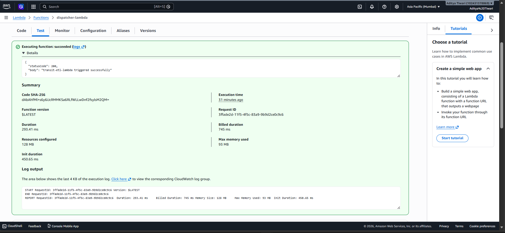
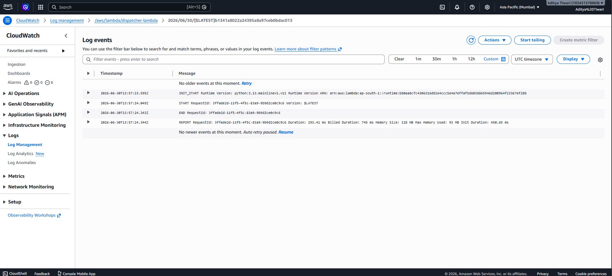

# 🚀 Delhi Transit Serverless ETL Pipeline with CI/CD

<p align="center">
A production-style <b>Serverless ETL Pipeline</b> built on AWS that automatically extracts, transforms, and loads Delhi Transit data using Amazon S3, AWS Lambda, Amazon DynamoDB, and a complete CI/CD pipeline powered by GitHub Actions, AWS CodeBuild, and AWS CodePipeline.
</p>

<p align="center">
  
  
  
  
</p>

<p align="center">
  
  
  
</p>

---

## 🏗️ Architecture Overview

```text
                        DELHI TRANSIT SERVERLESS ETL PIPELINE

                                      GitHub
                                         │
                                         ▼
                               GitHub Actions (CI)
                                Validate •  Build
                                         │
                                         ▼
                                 AWS CodeBuild
                              Install • Test • Package
                                         │
                                         ▼
                               AWS CodePipeline
                                  Build & Deploy
                                         │
──────────────────────────────────────────────────────────────────────────────

Transit Dataset (stops_v3.txt)
             │
             ▼
      Amazon S3 Bucket
     (Raw Data Storage)
             │
      S3 Object Created
             │
             ▼
      AWS Lambda Function
             │
     ┌───────┼────────┐
     │       │        │
     ▼       ▼        ▼
 Validate   Clean   Transform
     │       │        │
     └───────┼────────┘
             ▼
   Amazon DynamoDB Table
      (clean_records)
             │
             ▼
   Amazon CloudWatch Logs
      Metrics • Logs • Errors
```
---

## 🚀 File Type Based Routing

The project uses a **Dispatcher Lambda** that identifies the uploaded file type and invokes the appropriate parser Lambda.

| File Type | Lambda |
|-----------|--------|
| `.txt` | `transit-etl-lambda` |
| `.csv` | `csv-parser-lambda` |

This design makes the ETL pipeline modular and easy to extend for additional file formats.

## 📌 Dispatcher Workflow

```text
                  Upload File
                       │
                       ▼
                 Amazon S3 Bucket
                       │
                       ▼
              Dispatcher Lambda
                       │
          ┌────────────┴────────────┐
          ▼                         ▼
      TXT File                  CSV File
          │                         │
          ▼                         ▼
 transit-etl-lambda         csv-parser-lambda
          │                         │
          └────────────┬────────────┘
                       ▼
               Amazon DynamoDB
                       │
                       ▼
             Amazon CloudWatch
```
---

## Project Overview

This project demonstrates a **Serverless ETL Pipeline** built on AWS for processing Delhi Transit data.

### Features

- Event-driven ETL using AWS Lambda
- Raw data stored in Amazon S3
- Clean records stored in Amazon DynamoDB
- CloudWatch monitoring
- GitHub Actions for CI
- AWS CodeBuild for build validation
- AWS CodePipeline for CI/CD automation

### Workflow

```text
Upload Dataset
      │
      ▼
Amazon S3
      │
      ▼
AWS Lambda
      │
      ▼
Validate → Clean → Transform
      │
      ▼
Amazon DynamoDB
      │
      ▼
CloudWatch Logs
```

---

## ETL Workflow



| Stage | Description |
|--------|-------------|
| Extract | Read raw transit data from Amazon S3 |
| Transform | Validate, clean and standardize records |
| Load | Store processed records in DynamoDB |
| Audit | Generate execution logs in CloudWatch |

---
## AWS Services Used

| Service | Purpose |
|----------|---------|
| Amazon S3 | Store raw transit dataset |
| AWS Lambda | Extract, transform and load data |
| Amazon DynamoDB | Store cleaned records |
| Amazon CloudWatch | Monitor Lambda execution |
| AWS IAM | Manage permissions |
| GitHub | Source code management |
| GitHub Actions | Continuous Integration |
| AWS CodeBuild | Build validation |
| AWS CodePipeline | Continuous Delivery |

---
## Project Structure

```text
etl-s3-lambda-dynamodb/
│
├── .github/
│   └── workflows/
│       └── ci.yml
│
├── sample_data/
│   └── stops_v3.txt
│
├── screenshots/
│   ├── s3.png
│   ├── lambda.png
│   ├── dynamodb.png
│   ├── github-actions.png
│   └── codepipeline.png
│
├── lambda_function.py
├── requirements.txt
├── buildspec.yml
├── .gitignore
└── README.md
```

---
## Project Screenshots

### Amazon S3 (Raw Dataset)

Raw Delhi Transit dataset uploaded to Amazon S3.

<p align="center">

</p>

---

### AWS Lambda Execution logs

CloudWatch logs showing a successful ETL pipeline execution.

<p align="center">

</p>

---

### Amazon DynamoDB

Processed records stored in the `clean_records` table.

<p align="center">

</p>

---

### GitHub Actions

Continuous Integration workflow executed successfully.

<p align="center">

</p>

---

### AWS CodePipeline

End-to-end CI/CD pipeline execution.

<p align="center">

</p>

##  Dispatcher Lambda Test

The Dispatcher Lambda successfully detects the uploaded file type and invokes the appropriate parser Lambda.



---

##  Dispatcher CloudWatch Logs

CloudWatch logs confirming successful execution of the Dispatcher Lambda.



---
## Running Locally

Clone the repository:

```bash
git clone https://github.com/AdityaaaTiwari/etl-s3-lambda-dynamodb.git
```

Move into the project directory:

```bash
cd etl-s3-lambda-dynamodb
```

Install dependencies:

```bash
pip install -r requirements.txt
```

Run the Lambda function locally:

```bash
python lambda_function.py
```
---
## 🚀 Future Improvements

- Schedule automated ETL execution using **Amazon EventBridge**.
- Add **Amazon SNS** notifications for build and pipeline events.
- Deploy infrastructure using **AWS CloudFormation** or **Terraform**.
- Improve reliability with comprehensive **unit tests**.
- Package and deploy Lambda functions using **AWS SAM**.
- Add monitoring dashboards and alarms using **Amazon CloudWatch**.
  
---
## Author

**Aditya Tiwari**

B.Tech CSE Student

- GitHub: https://github.com/AdityaaaTiwari
- LinkedIn: https://www.linkedin.com/in/aditya-tiwari-a99739342/

If you found this project helpful, consider giving it a ⭐ on GitHub.
